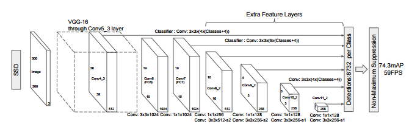

## Single-shot Multi-box Detector: A Single Pass Deep Neural Net for Object Detection
---
### Content: 

1. [Overview](#Overview)
2. [Network Structure](#NetworkStructure)
3. [Dependencies](#Dependencies)
4. [Preparation](#Preparation)
4. [Train](#Train)
5. [Prediction](#Prediction)
6. [Acknowledgement](#Acknowledgement)

### Overview: 

This is a re-implementation of the Single-shot Multi-box Detector model. The model is a unified framework for object detection, 
and can be trained end-to-end with high performance. More details can be found in the original 
[SSD: Single Shot MultiBox Detector](https://arxiv.org/abs/1512.02325) paper and their 
[slides](http://www.cs.unc.edu/~wliu/papers/ssd_eccv2016_slide.pdf). 

### Network Structure: 

The structure of the network is outlined in the photo below. 



The paper specifies setting default boxes of 4 different ratios at each map location. Our reimplementation follows the same
architecture. However, we trained our model using only 3 different aspect ratios (0.5, 1, 2) throughout all 6 prediction blocks.
The network takes training images of fixed size (300, 300, 3) and output 5820 predictions in the end for each image. 

### Dependencies: 

* Python 3.x
* Numpy
* TensorFlow 1.x
* Keras 2.x
* OpenCV
* matplotlib
* cocoapi (only if you are to retrain on the COCO dataset)

### Preparation: 

To train the model on the COCO dataset, you need to download the dataset from the [MS COCO dataset](http://cocodataset.org) 
website. Moreover, you will also need to clone the [cocoapi](https://github.com/cocodataset/cocoapi/) 
repository under the same folder that contains the SSD folder. To install cocoapi for Python3, simply run ```make``` under 
cocoapi/PythonAPI. Right now, our model does not support parsing data from other dataset. 

### Train: 

If you wish to retrain your model from scratch, you can run ```python train.py``` under the SSD folder. You will need to edit 
the ```train.py``` file to include the absolute path to the folder containing your training data: change ```data_dir``` to 
where your mscoco dataset locate, and change ```training_data``` to the data folder you want to train on (either ```train2017```
or ```val2017``` if you want to train on a smaller dataset). Check and make sure that ```exist``` is set to ```False```
to load the trained model. 

So far, we have trained our model for over 40k iterations to produce a 0.1849 loss and an iou accuracy of 0.4613. For the first 10k iterations, 
we use a batch size of 16, learning rate = 0.001 and decay-rate = 0. However, we changed this parameters to batch-size = 32, 
lr = 0.001 and decay-rate = 0.0005 for the rest of the training process. The original paper specify a training schedule
with batch size = 32, lr = 0.001 and decay-rate = 0.0005 for the first 160k iterations. Afterwards, the model was trained for
another 40k iterations with lr = 10^-4 and another 40k iterations with lr = 10^-5. 

You can also download our pre-trained model and weights to continue training or predictions. The pre-trained model can be
found [here](https://drive.google.com/file/d/1srlpSiVuuDdpiDFfAsGZU3mK_VMzbEen/view?usp=sharing). Check and make sure that 
```exist``` is set to ```True``` to load the trained model. 

Alternatively, we also provide the [`ssd300_training.ipybn`](ssd300_training.ipybn) and 
[`ssd300_prediction.ipybn`](ssd300_prediction.ipybn) files for training and predictions.

### Prediction: 

Our model has not been fully trained at this point. You can find the prediction results in our [`ssd300_prediction.ipybn`](ssd300_prediction.ipybn)
file in this repo. The model performs poorly overall, and shows consistantly strong results for the Person class on all
prediction images. We will update this `README.md` as our model progress. 

### Acknowledgement: 

This work was started as our final project in CSC262: Computer Vision class. We would like to thank Professor Jerod Weinman 
for his helpful instructions and comments on Convolutional Neural Networks and the SSD model. We also thank our friend
Darshan Mehta for helpful discussions in understanding single pass object detection model, and the concept of anchor boxes. 

